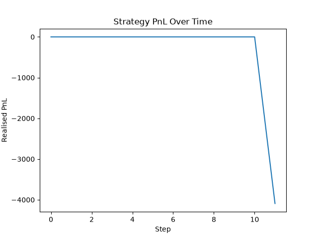

Simulacra: A limit order book exchange simulator and event-driven backtester in
Python, with price-time priority matching and pluggable trading strategies.

*This project focuses on exchange simulation and deterministic strategy 
backtesting rather than claiming live-market profitability.*

## Features
- Clean software engineering
- Event-driven simulation
- Order matching logic
- Software Testing discipline
- Basic trading-system understanding

## Tech Stack
- Language: Python.
- Tools: 
    - Pytest for testing
    - NumPy for mean() operation in the strategy classes
    - pandas to generate CSV logs
    - matplotlib to generate Profit and Loss (PnL) chart

## How to Run
- Clone the repository
- Create a python virtual environment: `python3 -m venv venv`
- Activate: `source venv/bin/activate`
- Install packages: `pip install -r requirements.txt`
- Run main.py
    - Try a different strategy using 
    - Edit events list on line 23 to modify outcome
- CSV files and PnL chart are located in the `results` directory
- Sample PnL Chart with current main.py programme:

- To run tests: `pytest`

## Architecture
```
Backtester (orchestrates the event loop)
 ├── Strategy (abstract base class)
 │     ├── MeanReversionStrategy
 │     └── TrendFollowingStrategy
 ├── MatchingEngine Trades
 │     └── OrderBook
 └── Portfolio
```

**Backtester** drives the simulation. For each market event it records the current
mid price, asks the strategy for an order, sends any resulting orders to the matching
engine, and passes the trades it gets back to the portfolio. It is the only component
that knows about all the others.

**Strategy** is an abstract base class defining a single method, `generate_order()`,
which returns one `Order` or `None` each step. `MeanReversionStrategy` and
`TrendFollowingStrategy` both compare the mid price to a moving average, in opposite
directions. Swapping strategies is a one-line change; the backtester never needs to
know which one it is running.

**MatchingEngine** takes an incoming limit order and crosses it against the best
opposing orders in the book while prices overlap. Trades execute at the resting
order's price, **partial fills are supported**, and any unfilled remainder rests in the
book. It returns the trades created by each match.

**OrderBook** is a passive container. Bids and asks are stored as price levels, each
holding a FIFO queue of orders, which gives price-time priority. It exposes best
bid/ask, mid price and spread, but performs no matching itself.

**Portfolio** tracks a single trader's cash and positions. It updates from trades
where that trader is the buyer or seller and ignores trades between other participants.

### Event flow

1. A market event (a limit order) arrives.
2. The backtester records the current mid price into the price history.
3. The strategy decides whether to place an order based on that history.
4. The strategy's order, then the market event, are each matched by the engine.
5. Resulting trades update the portfolio, and PnL is recorded for the step.

## Design Decisions
- Order book only acts as a container for the list of bids and asks whereas the matching engine handles the matching logic
    - Separates responsibilities for more maintainable code
- Price-time priority is modelled by a dictionary
    - Maps each price level to a deque
- Strategies use an abstract base class, ensuring that each future strategies
have implementations for the `generate_order()` method
- For this iteration, timestamps are hardcoded and not sourced using 
`time.time()`
    - Future improvements will seek to add this functionality

## Limitations
- Time is hardcoded with integer values instead of using `time.time()`
- Not tested with multiple portfolios nor multiple order books simultaneously
- No canceled order simulation
- Broker fees not accounted for

## What I learned
- How basic trading systems work
- OOP in Python
- Software Testing in Python